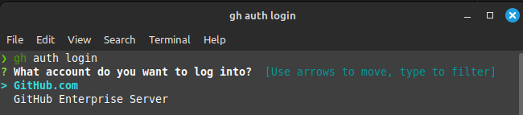
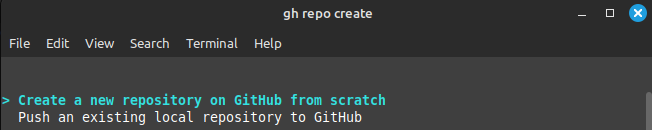
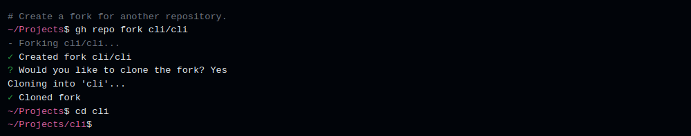

# **Base use of GitHub CLI**

GitHub CLI (**gh**) is a command-line tool that brings GitHub functionality to your terminal.This GitHub operations <br> without interacting with the graphical interface and remaining focused on the terminal.

## Basic command CLI

### **Authentification :**

Enter <code>gh auth login</code> and follow the prompts to log in using your GitHub ID

```
gh auth login <flag>
```


  Options  |  effect 
  ---| ---
```gh auth login --hostname github.example.com --web```| Authentificate without additional command



<br>
You can enter <code>gh auth logout</code> to log out.

### **Managing Repository :**

Enter <code> gh repo create </code> to create a repository.<br>
``` gh repo create ``` : create a repository 

  

  Options | Descriptions
  --- | ---
  ```-p```,```--template <repository>```|Make the new repository based on template repository.
  ```-t```,```team <name>```| The name of the organization team to be granted access
  ```-c```,```--clone```| Clone the new repository to the current directory
<br>

+ ```gh repo fork [<repository>] [flag]``` : to Fork a repository
+ ```gh repo clone [<repository>] [<directory>]``` : Clone a repository
+ ```gh repo view [<repository>] [flag]``` : view a repository

**Example for** : ```gh repo fork```

 

**Example for** : ```gh repo fork cli/cli``` : a flags to fork and clone directly


**Example for** : ```gh repo clone``` 


  Options | Descriptions
  --- | ---
  ``` -b ```,``` --branch <string>``` | View a specific branch of repository,
  ``` -w ```,``` --web``` | Open a repository in the browser


