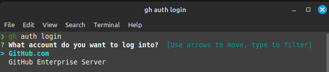

## Table des matières

- [Intoduction](./Intro_CLI_fr.md)
- [CheatSheet](./Cheat_sheet_fr.md)
- [Installation](./installCLI_fr.md)
- BaseUse
    - [Authentification](#auth)
    - [Gestion des dépôt](#repo)
    - [Gestion des issues](#issues)
    - [Gestion des pull requests](#pr)
    - [Gestion des workflows](#workflows)


  # **Utilisation basique de GitHub CLI**

GitHub CLI (**gh**) et un outil de ligne de commande qui apporte les fonctionnalité de GitHub dans le terminal.<br>Ce fonctionnement de GitHub fonctionne sans interagir avec l'interface graphique et permet de rester concentré sur le terminal.

## command de base de GitHub CLI

### <a id=auth></a> **Authentification :**

Entré <code>gh auth login</code> et suivre le prompts pour se connecter en utilisant notre identifiant GitHub.

```
gh auth login <flag>
```


  Options  |  Description 
  ---| ---
```gh auth login --hostname github.example.com --web```| S'authentifier sans commande supplémentaire 



<br>
Vous pouvez entrer cette commande <code>gh auth logout</code> pour vous déconnecter.

### <a id=repo></a> **Gestion des dépôts** :

Entrer <code> gh repo create </code> pour créer un dépot distant.<br>
``` gh repo create ``` : créer un dépot 

  

  Options | Description
  --- | ---
  ```-p```,```--template <repository>```|Faire que le nouveau dépôt sois basé sur ce template.
  ```-t```,```team <name>```| Le nom de l'organisation pour lui permettre d'avoir les accès.
  ```-c```,```--clone```| Clone le nouveau dépôt dans le chemin actuel. 
<br>

+ ```gh repo fork [<repository>] [flag]``` : pour Fork un dépôt
+ ```gh repo clone [<repository>] [<directory>]``` : Clone un dépôt
+ ```gh repo view [<repository>] [flag]``` : regarder un dépôt

**Exemple pour** : ```gh repo fork```

 

**Exemple pour** : ```gh repo fork cli/cli``` : un drapeau pour fork et cloner directement


**Exemple pour** : ```gh repo clone``` 


  Options | Description
  --- | ---
  ``` -b ```,``` --branch <string>``` | regarder une branche spécifique du dépôt
  ``` -w ```,``` --web``` | Ouvrir le dépôt dans le navigateur
<br>

### <a id=issues></a> **Gestion des issues**

  - ```gh issue create [flag]``` : créer une issue

  Options | Description
  --- | ---
  ```-t```, ```title <string>```| Fournie un titre
  ```-l```, ```label <name>``` | ajoute des étiquettes par nom
  ```-a```, ```assignee <login>``` | Attribue une personne a partir de son identifiant? utiliser "@me" pour m'assigner moi même

  **Exemple pour** : ``` gh issue create ``` : 

  

  **Exemple pour** : ``` gh issue create [flags] ``` : 

  

  - ```gh issue list [flag]```: Listes les issues

  Options | Description
  --- | ---
  ```-a```, ``` --assignee <string>``` | Filtre par assignation
  ```-A```, ``` --author <string>``` | Filtre par auteur
  ```-s```, ``` --state <string> (default "open")``` | Filtre par état: {ouvert\|fermer\|tout}
  ```-l```, ``` --label <strings>``` | Filtre par étiquettes

  **Exemple pour** : ``` gh issue list ``` :

  

  **Exemple pour** : ``` gh issue list [flags] ``` :

  

  - ```gh issue status``` : Affiche l'état des issues pertinents
  ```gh issue view {<number> | ur>} [flags]``` : Montre les issues spécifiques

  Options | Description
  --- | ---
  ```-c```,```--comments``` | Montre les commentaires du problèmes

  **Exemple pour** : ```gh issue status``` :

  

  ```issue close {<number> | <url>} [flags]``` : Ferme l'issue

  Options | Description
  ---| ---
  ```-c```, ``` --comment <string> ``` | Laisser un commentaire de clôture
  ```-r```, ``` --reason <string>``` | la raison de la fermeture

  <br>

### <a id=pr></a>**Gestion des pulls requests**

  - ```gh pr create [flags] ```: Créer une pull request

  Options | Description
  --- | ---
  ```-B```, ``` --base <branch>``` | La branche dans la qu'elle vous-voulez fusionner
  ```-f```, ``` --fill ``` | Utilise les infos du commit pour le titre et le corps
  ```-l```, ``` --label <name> ``` | Ajoute des étiquettes par nom

  **Exemple pour** : ``` gh pr create```: 

  

  **Exemple pour** : ``` gh pr create [flag] ```:

  

  - ```gh pr list [flags]``` : Liste les pulls requests

  Options | Description 
  --- | ---
  ```-a ```,```--assignee <string>``` | Filtre par assignation
  ```-A```, ``` -- author <string> ``` | Filtre par auteur
  ```-s```, ```--state <string> (default "open")``` | Filtre par état : {ouvert\|fermé\|fusionné\|tout}
  ```-l```,```--label <strings>``` | Filtre par étiquettes

  **Exemple pour** : ```gh pr list ```: 

  

  **Exemple pour** : ```gh pr list [flag]``` :

  

  - ```gh pr status``` : Affiche l'état des pulls requests relevé
  - ```gh pr view {<number> | <url> | <branch>} [flags]``` : Montre les pulls request spécifique

  Options | Description
  --- | ---
  ```-c```,```--comment <string>``` | Laisse un commentaire de réouverture

  **Exemple pour** : ```gh pr status``` :

  

  **Exemple pour** : ```gh pr view ``` : 

  

  **Exemple pour** : ```gh pr view <number> ```:<br> mais on peut utiliser d'autre arguments comme "Url" et "branch".

  

### <a id=workflows></a>**Gestion du workflow**

  - ```gh workflow list [flag]``` : Listé les fichiers du workflow, les workflow ne sont pas caché par défaut

  Options | Descripstion
  --- | ---
  ```-a```, ```--all``` | Inclure la désactivation des workflow

  - ```gh workflow view [<workflow-id> | <workflow-name | <filename>] [flags]```: Voir le résumé des Workflow
  - ```gh workflow run [<workflow-id> | <workflow-name>]``` : execute le workflow
  - ```gh workflow enable [<workflow-id> | <workflow-name>]``` : Active le workflow, lui permettant de fonctionner
  - ```gh workflow disable [<workflow-id> | <workflow-name>]``` : Désactiver le workflow, l'empêchant de fonctionner

  **Exemple pour** : ```gh workflow run [flag]``` :

  