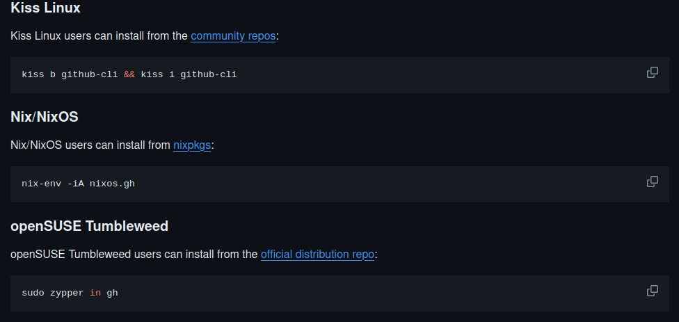

# Installing gh on Linux and BSD
Packages downloaded from https://cli.github.com or from https://github.com/cli/cli/releases are considered official binaries. We focus on popular Linux distros and the following CPU architectures: i386, amd64, arm64, armhf.
Other sources for installation are community-maintained and thus might lag behind our release schedule.
## Official sources
Debian, Ubuntu Linux, Raspberry Pi OS (apt)
Install:
```
sudo mkdir -p -m 755 /etc/apt/keyrings && wget -qO- https://cli.github.com/packages/githubcli-archive-keyring.gpg | sudo tee /etc/apt/keyrings/githubcli-archive-keyring.gpg > /dev/null \
&& sudo chmod go+r /etc/apt/keyrings/githubcli-archive-keyring.gpg \
&& echo "deb [arch=$(dpkg --print-architecture) signed-by=/etc/apt/keyrings/githubcli-archive-keyring.gpg] https://cli.github.com/packages stable main" | sudo tee /etc/apt/sources.list.d/github-cli.list > /dev/null \
&& sudo apt update \
&& sudo apt install gh -y
```
Install:
```
sudo apt update
sudo apt install gh 
``` 
Install from our package repository for immediate access to latest releases:
```
sudo dnf install 'dnf-command(config-manager)'
sudo dnf config-manager --add-repo https://cli.github.com/packages/rpm/gh-cli.repo
sudo dnf install gh
```
Fedora, CentOS, Red Hat Enterprise Linux (dnf)

Install from our package repository for immediate access to latest releases:
```
sudo dnf install 'dnf-command(config-manager)'
sudo dnf config-manager --add-repo https://cli.github.com/packages/rpm/gh-cli.repo
sudo dnf install gh
```
Alternatively, install from the community repository:
```
sudo dnf install gh
```
Upgrade:
```
sudo dnf update gh
```
Amazon Linux 2 (yum)
```
type -p yum-config-manager >/dev/null || sudo yum install yum-utils
sudo yum-config-manager --add-repo https://cli.github.com/packages/rpm/gh-cli.repo
sudo yum install gh
```
Upgrade:
```
sudo yum update gh
```
openSUSE/SUSE Linux (zypper)

Install:
```
sudo zypper addrepo https://cli.github.com/packages/rpm/gh-cli.repo
sudo zypper ref
sudo zypper install gh
```
Upgrade:

```
sudo zypper ref
sudo zypper update gh
```

## Unofficial, community-supported methods
**Arch Linux**

Arch Linux users can install from the extra repo:
```
sudo pacman -S github-cli
```
Alternatively, use the unofficial AUR package to build GitHub CLI from source.

**Android :**

Android 7+ users can install via Termux:
```
pkg install gh
```
**FreeBSD**

FreeBSD users can install from the ports collection:
```
cd /usr/ports/devel/gh/ && make install clean
```
**Or via pkg(8):**
```
pkg install gh
```
**NetBSD/pkgsrc**

NetBSD users and those on platforms supported by pkgsrc can install the gh package:
```
pkgin install gh
```
To install from source:
```
cd /usr/pkgsrc/net/gh && make package-install
```
**OpenBSD**
In -current, or in releases starting from 7.0, OpenBSD users can install from packages:

```
pkg_add github-cli
```

**Funtoo**

Funtoo Linux has an autogenerated github-cli package, located in dev-kit, which can be installed in the following way:
```
emerge -av github-cli
```
Upgrading can be done by syncing the repos and then requesting an upgrade:
```
ego sync
emerge -u github-cli
```
**Gentoo**

Gentoo Linux users can install from the main portage tree:
```
ego sync
emerge -u github-cli
```
Upgrading can be done by updating the portage tree and then requesting an upgrade:
```
emerge --sync
emerge -u github-cli
```



